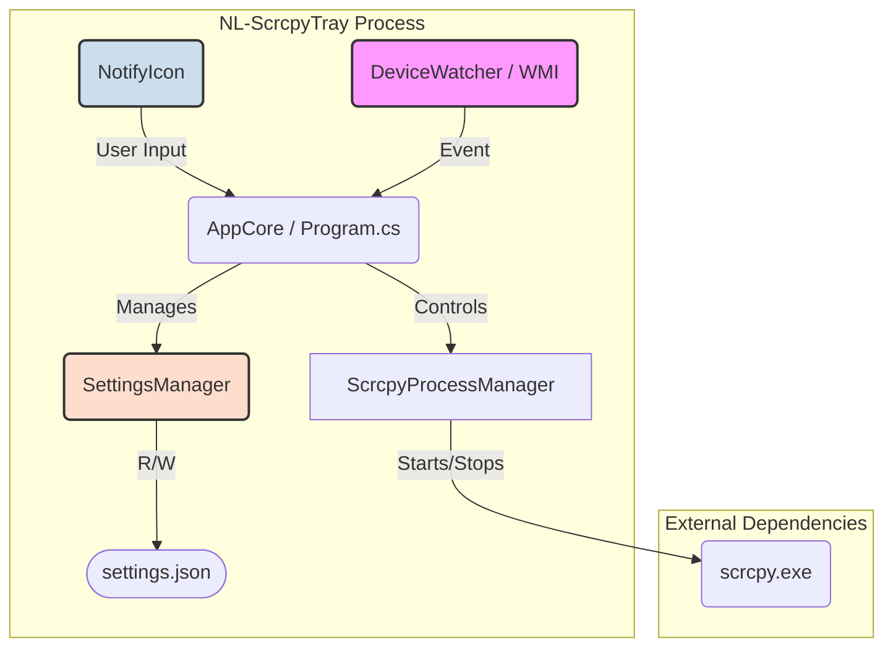

# NL-ScrcpyTray アーキテクチャ設計書

## 1. はじめに

このドキュメントは、`NL-ScrcpyTray` アプリケーションの技術的な構造、コンポーネント、および設計思想を定義します。
プロジェクトの全体像を明確にし、将来の機能追加やメンテナンスを円滑に実施することを目的とします。

## 2. 概要

`NL-ScrcpyTray` は、Androidデバイスの画面をPCにミラーリングするツール `scrcpy` を、Windowsのタスクトレイから容易に利用できるようにする常駐型アプリケーションです。
USBデバイスの接続を自動的に検知し、ユーザーが定義した設定に基づいて `scrcpy` を起動・制御します。

## 3. アーキテクチャ図

アプリケーションは以下の主要コンポーネントで構成されます。



## 4. コンポーネント詳細

### 4.1. UI (NotifyIcon)

-   **責務:** ユーザーインターフェースを提供します。
-   **機能:**
    -   タスクトレイにアイコンを表示し、アプリケーションの状態（待機中/実行中）を示します。
    -   コンテキストメニュー（右クリック）を提供し、手動での起動/停止、設定変更、アプリケーションの終了といった操作を受け付けます。
    -   `scrcpy` の実行状態やデバイスの接続状況に応じて、バルーンチップ通知を表示します。

### 4.2. AppCore (Program.cs)

-   **責務:** アプリケーション全体のライフサイクルと、各コンポーネント間の連携を管理する中核。
-   **機能:**
    -   アプリケーションの起動と終了処理を制御します。
    -   `DeviceWatcher` からのイベントを受け取り、`AutoStart` 設定に基づいて `ScrcpyProcessManager` に `scrcpy` の起動を指示します。
    -   `UI` からのユーザー操作を解釈し、適切な処理をディスパッチします。
    -   `SettingsManager` を通じて設定を読み込み、アプリケーションの挙動に反映させます。

### 4.3. ScrcpyProcessManager

-   **責務:** `scrcpy.exe` プロセスの起動と停止を専門に担当します。
-   **機能:**
    -   `SettingsManager` から取得した設定値（画質、オーディオ有無など）を基に、`scrcpy.exe` のコマンドライン引数を構築します。
    -   `Process.Start()` を用いて `scrcpy` プロセスを生成・起動します。
    -   `scrcpy` プロセスが予期せず終了したことを検知し、`AppCore` に通知します。
    -   アプリケーション終了時やユーザーの指示により、起動中の `scrcpy` プロセスを安全に終了させます。

### 4.4. DeviceWatcher (WMI)

-   **責務:** Windows Management Instrumentation (WMI) を利用して、USBデバイスの物理的な接続・切断イベントを監視します。
-   **機能:**
    -   `Win32_DeviceChangeEvent` (EventType=2) を監視し、USBデバイスが接続された際にイベントを発生させます。
    -   発生したイベントを `AppCore` に通知します。

### 4.5. SettingsManager

-   **責務:** アプリケーションの設定を永続化します。
-   **機能:**
    -   `settings.json` ファイルの読み込みと書き込みを担当します。
    -   `System.Text.Json` を利用して、設定クラスとJSON文字列との間でシリアライズ/デシリアライズを行います。
    -   設定ファイルが存在しない場合は、デフォルト設定で新規作成します。

## 5. ディレクトリ構成

ポータブルアプリケーションとしての利便性を最大化するため、以下のディレクトリ構成を採用します。

```
/NL-ScrcpyTray/
├── NL-ScrcpyTray.exe       (実行ファイル)
├── settings.json           (ユーザー設定ファイル)
└── scrcpy/                 (scrcpy 本体一式)
    ├── scrcpy.exe
    ├── adb.exe
    └── ... (各種DLL)
```

-   **scrcpyの内蔵:** ユーザーが別途 `scrcpy` をダウンロードしたり、環境変数 `PATH` を設定したりする必要をなくし、UXを向上させます。
-   **settings.jsonの配置:** 実行ファイルと同じ場所に設定ファイルを置くことで、アプリケーションフォルダを別のPCにコピーするだけで、すべての設定が引き継がれるポータブル性を実現します。

## 6. 将来の設計方針 (リファクタリング)

現状、すべてのロジックは `Program.cs` 内の `static` メソッドとして実装されています。これは初期段階のプロトタイプとしては有効ですが、機能が複雑化するにつれて見通しが悪くなります。

今後の開発では、以下の指針で責務をクラスに分割していくことを推奨します。

-   **`ScrcpyController.cs`:** `ScrcpyProcessManager` と `SettingsManager` のロジックを統合し、`scrcpy` の起動・停止に関するすべての責務を担います。
-   **`TrayMenuManager.cs`:** `NotifyIcon` のコンテキストメニュー構築と更新に関するロジックを分離します。
-   **`AppService.cs`:** アプリケーションのメインループと、各クラスのインスタンス化および連携を管理します。

これにより、各クラスが単一責任の原則に従い、テスト容易性と保守性が向上します。