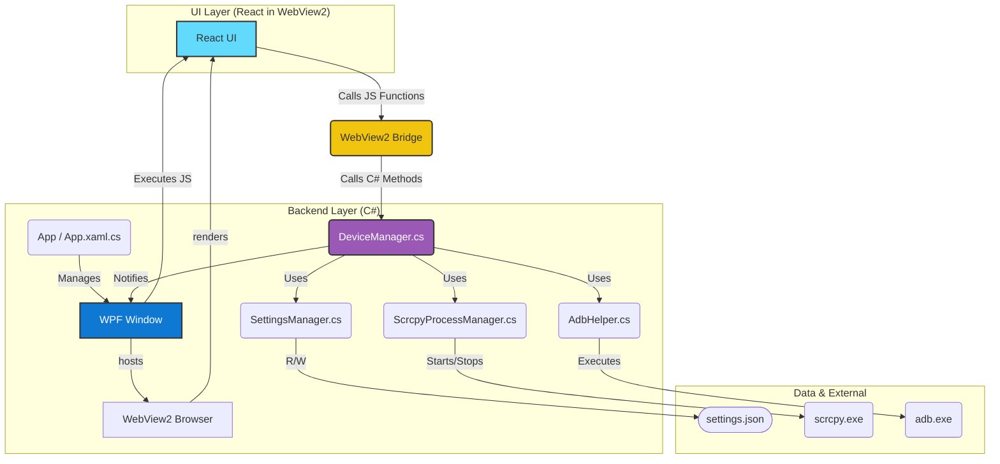

# NL-ScrcpyTray アーキテクチャ設計書

## 1. はじめに

このドキュメントは、`NL-ScrcpyTray` アプリケーションの技術的な構造、コンポーネント、および設計思想を定義します。
プロジェクトの全体像を明確にし、将来の機能追加やメンテナンスを円滑に実施することを目的とします。

## 2. 概要

`NL-ScrcpyTray` は、`scrcpy` を強力に補完するWindows常駐型アプリケーションです。
**WPF (または WinUI 3) と WebView2 (React) を組み合わせた最新のUI** を採用し、複数デバイスの管理、有線/無線のシームレスな切り替え、詳細なプロファイル設定など、高度な機能を提供します。

## 3. アーキテクチャ図

アプリケーションは、C#で記述されたバックエンドと、Reactで記述されたフロントエンドから構成されます。



## 4. コンポーネント詳細

### 4.1. UI (WPF + WebView2 + React)

-   **責務:** 高度でインタラクティブなユーザーインターフェースを提供します。
-   **コンポーネント:**
    -   **WPF Window:** アプリケーションのネイティブウィンドウ。WebView2コントロールをホストします。
    -   **WebView2:** Reactで構築されたWebベースのUIをレンダリングするブラウザエンジン。
    -   **React Frontend:** `frontend/` ディレクトリに格納されたReact/Viteプロジェクト。コンポーネントベースで構築され、デバイスリスト、設定モーダルなどのUIを動的に描画します。
    -   **WebView2 Bridge:** React (JavaScript) と C# バックエンド間の通信を仲介する重要な役割を担います。UIからの操作をバックエンドに伝え、バックエンドからの状態変更をUIにプッシュします。

### 4.2. AppCore (App.xaml.cs)

-   **責務:** WPFアプリケーションのライフサイクル管理と、バックエンドサービスの初期化を担当します。
-   **機能:**
    -   アプリケーション起動時に、各マネージャークラス（`DeviceManager` など）をインスタンス化します。
    -   メインウィンドウ (`WpfWindow`) を生成し、表示します。
    -   アプリケーション終了時のクリーンアップ処理を行います。

### 4.3. DeviceManager (New)

-   **責務:** **アプリケーションの頭脳。** 接続されている全デバイスの状態を一元管理し、ユーザー操作やイベントに応じて適切な処理をディスパッチします。
-   **機能:**
    -   `DeviceWatcher` からの物理的な接続/切断イベントを購読します。
    -   定期的に `AdbHelper.GetConnectedDevices` を実行し、デバイスの状態（USB/Wi-Fi/Offline）を更新します。
    -   `SettingsManager` から読み込んだ設定に基づき、自動接続、有線/無線ハンドオーバーなどのロジックを実行します。
    -   `WebView2 Bridge` を介して、UIにデバイスリストの変更を通知します。
    -   UIからの操作（ミラーリング開始/停止、設定変更など）を受け取り、`ScrcpyProcessManager` や `SettingsManager` に処理を委譲します。

### 4.4. ScrcpyProcessManager

-   **責務:** `scrcpy.exe` プロセスの起動と管理を専門に担当します。**複数インスタンスの管理能力**が追加されます。
-   **機能:**
    -   デバイスごとの設定プロファイルに基づき、`scrcpy.exe` のコマンドライン引数を構築します。
    -   **デバイスIDをキーとして**、実行中の `scrcpy` プロセスを辞書などで管理します。
    -   指定されたデバイスのプロセスを起動、または安全に終了させます。

### 4.5. DeviceWatcher (WMI)

-   **責務:** (WMIによる監視からポーリングに変更) USBデバイスの接続・切断を定期的に検知します。
-   **機能:**
    -   `DeviceManager`内の`Timer`により、定期的に`AdbHelper.GetConnectedDevices`を実行し、デバイスリストの差分を検出します。

### 4.6. SettingsManager

-   **責務:** アプリケーション設定の永続化を担当します。**マルチデバイス対応の複雑なデータ構造**を扱います。
-   **機能:**
    -   `feature-spec.md` で定義された新しい `settings.json` 構造の読み込みと書き込みを行います。
    -   デバイスの追加、削除、並べ替えなどの操作をサポートします。

### 4.7. AdbHelper (AdbHelper.cs)

### 4.7. AdbHelper (AdbHelper.cs)

-   **責務:** `adb.exe` コマンドの実行と、その結果の解析を専門に担当します。デバイスの物理的な接続状態や接続モード（USB/ワイヤレス）に関するロジックは持ちません。
-   **機能:**
    -   同梱された `adb.exe` のパスを解決します。
    -   `adb devices -l`: 接続されているデバイスのリスト（シリアル、モデル名等）を取得します。
    -   `adb tcpip (port)`: 指定されたデバイスをTCP/IPデバッグモードに移行させます。
    -   `adb connect (ip:port)`: 指定されたIPアドレスのデバイスにワイヤレスで接続します。
    -   `adb disconnect (ip:port)`: ワイヤレス接続を切断します。
    -   `adb shell ip addr show wlan0`: デバイスのローカルIPアドレスを取得します。

## 5. ディレクトリ構成

ポータブルアプリケーションとしての利便性を最大化するため、以下のディレクトリ構成を採用します。

```
/NL-ScrcpyTray/
├── NL-ScrcpyTray.exe       (実行ファイル)
├── settings.json           (ユーザー設定ファイル)
└── scrcpy/                 (scrcpy 本体一式)
    ├── scrcpy.exe
    ├── adb.exe
    └── ... (各種DLL)
```

-   **scrcpyの内蔵:** ユーザーが別途 `scrcpy` をダウンロードしたり、環境変数 `PATH` を設定したりする必要をなくし、UXを向上させます。
-   **settings.jsonの配置:** 実行ファイルと同じ場所に設定ファイルを置くことで、アプリケーションフォルダを別のPCにコピーするだけで、すべての設定が引き継がれるポータブル性を実現します。

## 6. 将来の設計方針 (リファクタリング)

現状、すべてのロジックは `Program.cs` 内の `static` メソッドとして実装されています。これは初期段階のプロトタイプとしては有効ですが、機能が複雑化するにつれて見通しが悪くなります。

今後の開発では、以下の指針で責務をクラスに分割していくことを推奨します。

-   **`ScrcpyController.cs`:** `ScrcpyProcessManager` と `SettingsManager` のロジックを統合し、`scrcpy` の起動・停止に関するすべての責務を担います。
-   **`TrayMenuManager.cs`:** `NotifyIcon` のコンテキストメニュー構築と更新に関するロジックを分離します。
-   **`AppService.cs`:** アプリケーションのメインループと、各クラスのインスタンス化および連携を管理します。

これにより、各クラスが単一責任の原則に従い、テスト容易性と保守性が向上します。